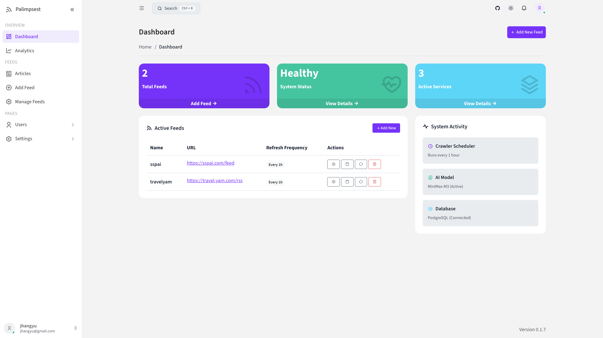
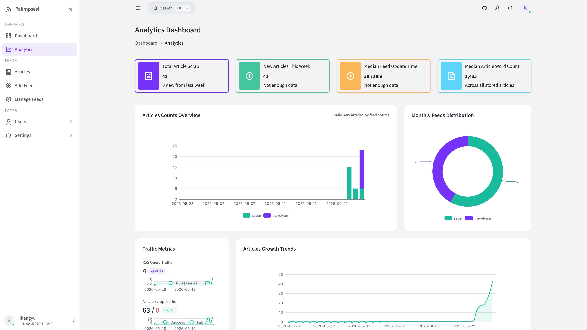
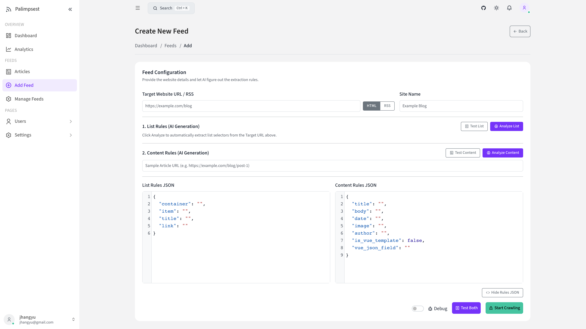
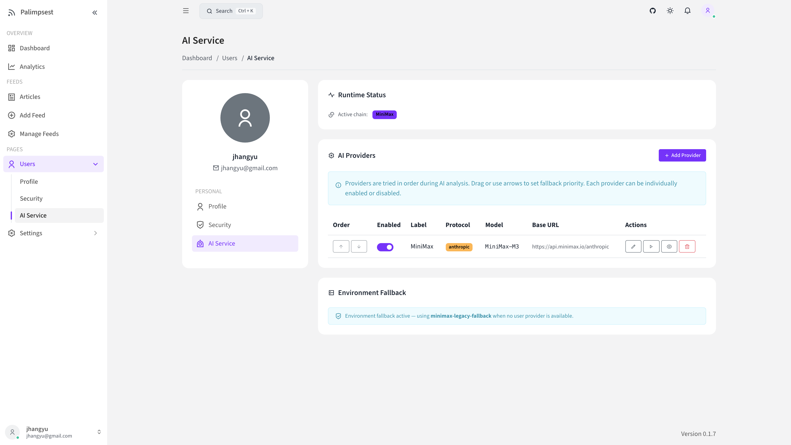
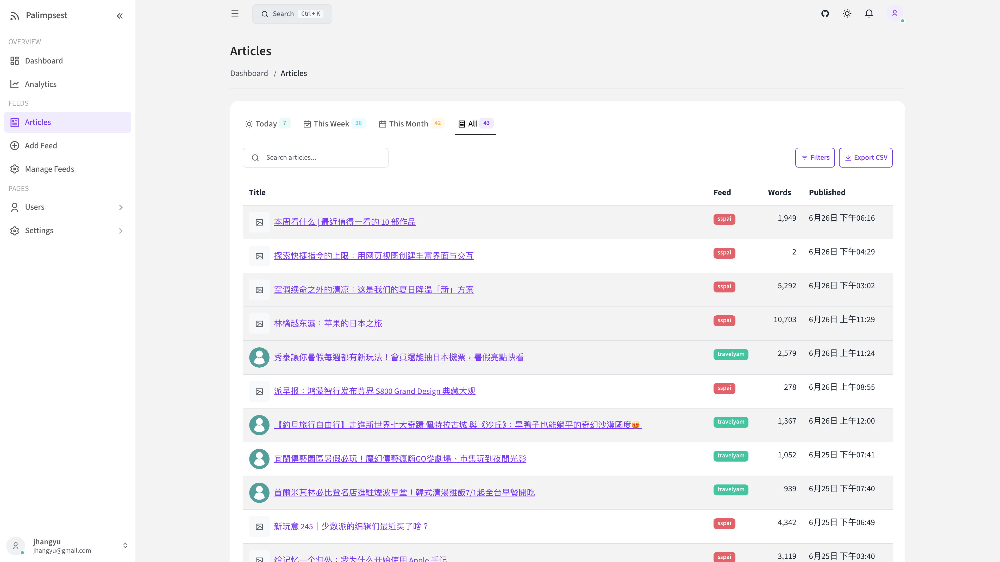
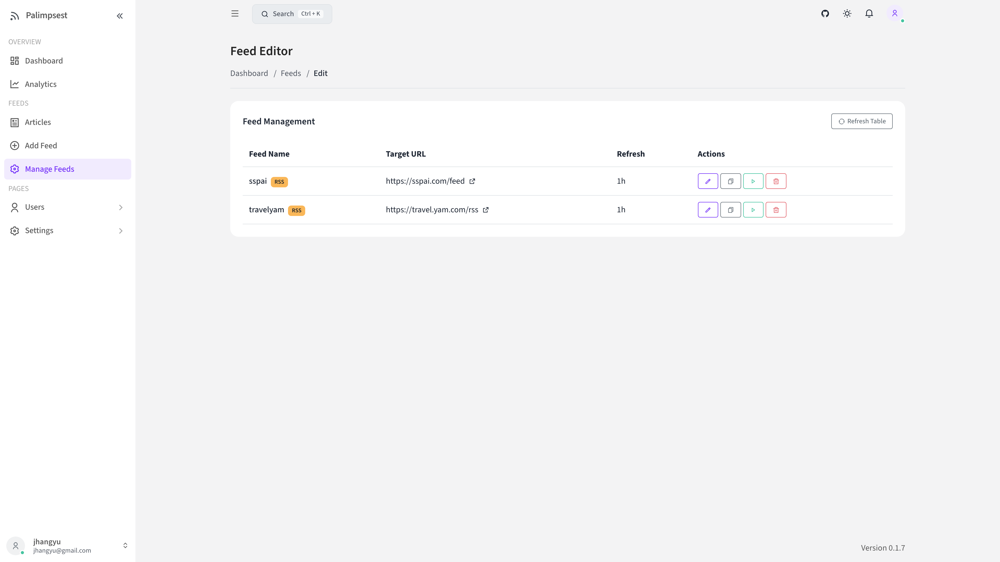

# palimpsest

AI-assisted RSS feed generator. Provide a target website URL, and the system automatically crawls pages, uses AI to infer CSS selectors for list and article content, extracts structured articles, and serves standard RSS feeds.

## Features

### Two-Stage RSS Extraction

- **List page analysis**: AI infers CSS selectors for article links, titles, and dates from the listing page HTML (`list_rules`)
- **Content page analysis**: AI infers selectors for article body, author, and images from individual article pages (`content_rules`)
- Each stage is independently configurable — users can manually refine AI-suggested selectors via the Analyze page

### AI-Powered CSS Selector Inference

- Sends structurally-cleaned HTML to an LLM for selector inference; `clean_html_for_ai` strips noise separately for list vs. content mode
- Supports OpenAI, Anthropic, Gemini, and any OpenAI-compatible endpoint — configured per user
- Interactive Analyze page lets users test selectors and iterate without re-crawling

### Lazy-Load Image Resolution

- Modern sites use `src="/placeholder.png"` with real URLs in `data-original`, `data-src`, `data-lazy-src`, or `data-lazy` attributes — standard parsers miss these
- `_resolve_lazy_images()` resolves the fallback chain and is applied at three pipeline stages: content sanitization, AI HTML cleaning (list and content modes), and hero image extraction
- feedparser's HTML sanitizer is patched to preserve lazy-load attributes so they survive the sanitization pass

### HTML Sanitizer Pipeline

- `sanitize_content_html`: strict tag whitelist (p, span, a, img, ul, ol, li, h2–h6, figure, code, strong, em) produces clean RSS output
- `clean_html_for_ai`: reduces full-page HTML to the relevant container before sending to the LLM, with separate list and content modes
- Vue.js detection: `decode_vue_gallery` decodes `x-data` component JSON into standard HTML; `extract_template_html` handles Vue template structures

### Multi-Provider AI with Ordered Fallback

- Per-user provider profiles with drag-to-reorder priority; providers can be individually enabled or disabled
- Fallback engine: works through the priority chain under a shared total deadline, classifying failures progressively
- Model discovery and connection test built into the management UI; API key reveal is password-gated
- SSRF protection: DNS resolution validation blocks private/LAN/cloud-metadata IPs for custom endpoints

### KEK Envelope Encryption

- API keys encrypted at rest using KEK/DEK envelope encryption — the KEK never touches the database
- AAD binding (user, provider, protocol, base URL, version) prevents credential-swapping attacks even with database access
- KEK is auto-generated on first startup; stored in a Docker volume or `.dev-secrets/` — no manual key setup
- Fail-closed: if the KEK is unavailable and providers are configured, the application refuses to start

### Crawl Auto-Repair

- `RepairOrchestrator`: consecutive crawl failures automatically trigger AI re-analysis of the feed's source page
- Full flow: failure counting → weekly budget check → AI re-analyze → evidence-based candidate validation → atomic rule promotion
- Candidate rules are validated by re-parsing the live HTML before any promotion — old rules are preserved on any failure path
- AI calls are never held inside a database transaction

### Article Filter Engine

- Recursive tri-state rule evaluation supporting both blacklist and whitelist modes
- Field targeting: filter on title, content, or both; regex supported for pattern matching
- Configured per-feed via the edit page — no global filter that affects all feeds

### Crawl Infrastructure

- Multi-method fetching: Scrapling as the default with Playwright (headless Chromium) as an automatic fallback
- `asyncio.gather` + `Semaphore(3)` for parallel article fetching; browser instances are reused within a single crawl run
- APScheduler with per-site refresh intervals and random jitter to prevent thundering-herd effects on shared origins
- Debug output system captures per-stage intermediate artifacts for troubleshooting extraction issues

## Screenshots

| | |
|---|---|
|  |  |
| Dashboard — feed overview and system status | Analytics — article growth charts and statistics |
|  |  |
| Add Feed — two-stage AI analysis with List/Content rules | AI Service — multi-provider management with fallback chain |
|  |  |
| Articles — full article list with search and filtering | Manage Feeds — feed list with actions |

## Quick Start With Docker

### Docker Compose Example

Create a `docker-compose.yml` file:

```yaml
services:
  db:
    image: postgres:17-alpine
    container_name: palimpsest-db
    environment:
      POSTGRES_USER: palimpsest
      POSTGRES_PASSWORD: palimpsest
      POSTGRES_DB: palimpsest
    volumes:
      - ./data/postgres:/var/lib/postgresql/data
    healthcheck:
      test: ["CMD-SHELL", "pg_isready -U palimpsest -d palimpsest"]
      interval: 10s
      timeout: 5s
      retries: 5
    networks:
      - palimpsest-network

  chrome:
    image: browserless/chrome:latest
    container_name: palimpsest-chrome
    environment:
      MAX_CONCURRENT_SESSIONS: 10
      CONNECTION_TIMEOUT: 300000
    ports:
      - "3000:3000"
    networks:
      - palimpsest-network

  app:
    image: jhangyu/palimpsest:latest
    container_name: palimpsest-app
    environment:
      DATABASE_URL: postgresql://palimpsest:palimpsest@db:5432/palimpsest

      # Browserless Chrome connection
      CHROME_MODE: server
      CHROME_WS_ENDPOINT: ws://chrome:3000
      BROWSER_WS_URL: ws://chrome:3000
      POSTGRES_HOST: db
      POSTGRES_PORT: 5432
      CHROME_HOST: chrome
      CHROME_PORT: 3000

      # App settings
      BACKEND_PORT: 8088
      PALIMPSEST_DATA_DIR: /app/data
      PALIMPSEST_LOG_DIR: /app/log

      # KEK (Key Encryption Key) — auto-generated on first startup, no manual setup needed
      LLM_KEK_PATH: /app/data/kek
      LLM_KEK_VERSION: v1

      # LLM provider settings
      LLM_PROVIDER_PROFILES_ENABLED: "true"
      LLM_FALLBACK_ENABLED: "true"
      LLM_FALLBACK_PROTOCOL: openai
      LLM_FALLBACK_MAX_TOKENS: "4096"
      LLM_FALLBACK_THINKING: "false"
      LLM_FALLBACK_EFFORT: low
      # Uncomment and fill in to use a fallback LLM provider at startup:
      # LLM_FALLBACK_BASE_URL: https://api.openai.com/v1
      # LLM_FALLBACK_API_KEY: sk-your-key-here
      # LLM_FALLBACK_MODEL: gpt-4o

      # Auth settings
      SESSION_COOKIE_SECURE: "false"
      SESSION_TTL_HOURS: "24"
      AUTH_ALLOW_PUBLIC_REGISTRATION: "false"
      AUTH_DEV_EXPOSE_RESET_LINK: "true"

      # CORS (leave empty to allow all origins, or set your frontend URL)
      ALLOWED_ORIGINS: ""
      FRONTEND_ORIGIN: ""
    volumes:
      - ./data/app:/app/data
      - ./log:/app/log
    ports:
      - "8088:8088"
    depends_on:
      db:
        condition: service_healthy
      chrome:
        condition: service_started
    networks:
      - palimpsest-network
    healthcheck:
      test: ["CMD", "python", "-c", "import urllib.request; urllib.request.urlopen('http://localhost:8088/health', timeout=5).read()"]
      interval: 30s
      timeout: 10s
      retries: 3
      start_period: 10s

networks:
  palimpsest-network:
    driver: bridge
```

### Start the Stack

```bash
docker compose up -d
```

### First-Run Setup

Open [http://localhost:8088](http://localhost:8088) in your browser. When no users exist, the app automatically redirects to the first-run setup page where you can create the admin account.

> The KEK (Key Encryption Key) keyring is auto-generated on first startup — no manual key file creation or keyring directory setup is needed.

### Configure AI Provider (Optional)

After logging in, go to **Settings → AI Service** to add LLM providers (OpenAI, Anthropic, Gemini, or any OpenAI-compatible endpoint).

Alternatively, set the `LLM_FALLBACK_*` environment variables directly in `docker-compose.yml` before starting the stack:

```yaml
LLM_FALLBACK_BASE_URL: https://api.openai.com/v1
LLM_FALLBACK_API_KEY: sk-your-key-here
LLM_FALLBACK_MODEL: gpt-4o
```

### Services

| Service | Port | URL |
| --- | --- | --- |
| App dashboard + API | 8088 | http://localhost:8088 |
| Browserless Chrome | 3000 | http://localhost:3000 |

## Repository Layout

```text
.
├── backend/                              # FastAPI application
│   ├── main.py                           # App entry point, lifespan, scheduler, router wiring
│   ├── scheduler.py                      # APScheduler setup and per-site job management
│   ├── core/                             # Business logic modules
│   │   ├── ai.py                         # AI structure analysis, template extraction, gallery decoding
│   │   ├── ai_provider_migrations.py     # AI provider schema and migration helpers
│   │   ├── ai_providers.py               # Provider CRUD repository/service layer
│   │   ├── auth.py                       # Argon2id hashing, sessions, CSRF, rate limits, dependencies
│   │   ├── cdp_client.py                 # CDP (Chrome DevTools Protocol) client utilities
│   │   ├── crawl_outcomes.py             # Typed outcome models and pure-function crawl classifier
│   │   ├── crawl_repair_models.py        # Schema declarations and Pydantic models for auto-repair
│   │   ├── crawl_repair_repository.py    # Transactional, concurrent-safe auto-repair state storage
│   │   ├── crawl_repair_service.py       # RepairOrchestrator: failure counting, AI re-analyze, rule promotion
│   │   ├── crawl_repair_startup.py       # Lifecycle hooks for wiring auto-repair into app startup
│   │   ├── crawl_utils.py                # Shared crawl utilities (normalize, extract, parse)
│   │   ├── crawler.py                    # Playwright crawler, parallel fetching, word count helper
│   │   ├── crypto.py                     # AES-GCM authenticated encryption, token mask/reveal
│   │   ├── db.py                         # SQLAlchemy 2.0 async engine, table definitions, metadata
│   │   ├── debug.py                      # Debug writer with per-stage artifact output
│   │   ├── email.py                      # Email sender (SMTP or dev-mode log output)
│   │   ├── feed_parser.py                # RSS/Atom feed parser with feedparser integration and lazy-load attribute preservation
│   │   ├── filter_engine.py              # Recursive tri-state article filter (blacklist/whitelist, regex)
│   │   ├── logging_utils.py              # Unified logging utilities
│   │   ├── ownership.py                  # Feed ownership authorization helpers
│   │   ├── parser.py                     # Pure parsing layer — Scrapling-based article and listing parsers with lazy-load fallback
│   │   ├── sanitizer.py                  # HTML sanitizer: tag whitelists, lazy-load image resolution, Vue gallery decoding
│   │   ├── scraper.py                    # Scrapling fetcher abstraction with Playwright fallback
│   │   ├── security_models.py            # Pydantic models for all auth/user/admin schemas
│   │   ├── time_provider.py              # Deterministic clock abstraction for crawl auto-repair
│   │   ├── vue_parser.py                 # Vue.js template JSON extraction
│   │   └── llm/                          # LLM abstraction layer
│   │       ├── base.py                   # LLMProvider Protocol, BaseHTTPProvider
│   │       ├── service.py                # Resolver + ordered fallback engine
│   │       ├── result_parser.py          # Prompt builder and result parser
│   │       ├── models.py                 # Shared LLM data models
│   │       ├── endpoints.py              # Endpoint URL normalization per protocol
│   │       ├── registry.py               # Protocol-to-adapter registry
│   │       ├── key_backends.py           # Versioned file/Docker Secret KEK backend
│   │       ├── vault.py                  # DEK envelope encryption, KEK rotation primitives
│   │       ├── network_policy.py         # SSRF validation and verified-IP allowlist
│   │       ├── network_transport.py      # Verified-IP HTTP transport with DNS pinning
│   │       ├── openai_provider.py        # OpenAI-compatible adapter
│   │       ├── anthropic_provider.py     # Anthropic-compatible adapter
│   │       └── gemini_provider.py        # Gemini-compatible adapter
│   ├── routers/                          # FastAPI router modules
│   │   ├── _deps.py                      # Shared dependencies and logging helper
│   │   ├── admin.py                      # Admin user and role management endpoints
│   │   ├── ai_providers.py               # AI provider CRUD, test, reveal, discover-models endpoints
│   │   ├── analytics.py                  # Analytics overview and article list endpoints
│   │   ├── auth.py                       # Auth endpoints (login, logout, register, password reset)
│   │   ├── database.py                   # Database status, migration, export, import endpoints
│   │   ├── notifications.py              # Crawl failure and repair event notification endpoints
│   │   ├── sites.py                      # Feed/site CRUD, crawl, analyze, RSS endpoints
│   │   └── users.py                      # User profile, avatar, password, preferences endpoints
│   └── services/                         # Standalone service modules
│       ├── analytics_service.py          # Analytics aggregation and query logic
│       └── export_service.py             # Database export (JSON / ZIP) logic
├── frontend-astro/                       # Astro dashboard
│   ├── config/astro.config.mjs           # Astro configuration (Vite proxy, allowedHosts)
│   ├── tools/dev.mjs                     # Dev server driver (Astro + CSS watch)
│   ├── tools/css.mjs                     # CSS pipeline (SCSS -> PostCSS -> LightningCSS)
│   ├── src/html/pages/                   # Astro page templates
│   │   ├── feeds/add.astro               # Add feed page
│   │   ├── feeds/edit.astro              # Edit feed page
│   │   ├── settings/database.astro       # Database management page (admin)
│   │   ├── settings/users.astro          # User management page (admin)
│   │   ├── users/ai-service.astro        # AI service configuration page
│   │   ├── users/edit.astro              # Edit user page (admin)
│   │   ├── users/profile.astro           # User profile page
│   │   ├── users/security.astro          # Security settings page
│   │   ├── analytics.astro               # Analytics dashboard page
│   │   ├── articles.astro                # Article list page
│   │   └── dashboard.astro               # Main dashboard page
│   ├── src/html/components/              # Astro component library
│   │   ├── feeds/FeedRulesEditor.astro   # Feed rules editor with CodeMirror
│   │   └── app/CommandPalette.astro      # Command palette for quick navigation
│   ├── src/html/layouts/                 # Layout components (admin layout, sidebar, head)
│   ├── src/scripts/                      # TypeScript business logic (22 modules)
│   ├── src/js/                           # Rollup IIFE bundles (dark mode, sidebar)
│   └── src/scss/                         # SCSS sources (gentelella + custom)
├── tests/                                # Backend and E2E test suite
│   ├── stage1/                           # Unit tests
│   │   ├── conftest.py                   # Pytest fixtures (test DB, auth fixtures)
│   │   ├── test_auth.py                  # Auth unit/integration tests
│   │   ├── test_crawl_repair_*.py        # Crawl auto-repair tests (models, repository, service, integration)
│   │   ├── test_feed_parser.py           # Feed parser tests
│   │   ├── test_llm_*.py                 # LLM adapter, vault, fallback, registry tests
│   │   └── test_*_migration*.py          # Migration and site ownership tests
│   └── stage2/                           # E2E and integration tests
│       ├── e2e/                          # Playwright E2E tests (434 tests across 11 spec files)
│       └── integration/                  # Shell-based integration tests
├── docs/                                 # AI development notes and task logs
├── Dockerfile                            # Multi-stage: frontend build + Python runtime
├── docker-compose.yml                    # Production deployment (app image jhangyu/palimpsest:latest)
├── docker-compose-dev.yml                # Development compose variant
├── entrypoint.sh                         # Container startup: wait for DB/Chrome, auto-generate KEK if absent, launch uvicorn
├── restart.sh                            # Local dev startup helper (backend + Astro dev server)
└── .env.example                          # Environment variable template
```

Ignored directories (not in version control):

- `data/`: PostgreSQL bind mount and app runtime data
- `log/`: runtime logs and debug output
- `.dev-secrets/`: local KEK keyring for development
- `node_modules/`, `.venv/`, `venv/`, `.astro/`, `dist/`: generated dependencies and build output

## Requirements

### Docker Deployment

- Docker and Docker Compose v2
- Optionally, LLM provider API keys for AI features

### Local Development

- Python 3.13+
- Node.js 22+
- npm
- Playwright browser dependencies (`playwright install chromium`)
- PostgreSQL 17+

## Environment Variables

### Database

| Variable | Default | Description |
| --- | --- | --- |
| `POSTGRES_USER` | `palimpsest` | PostgreSQL user |
| `POSTGRES_PASSWORD` | `palimpsest` | PostgreSQL password |
| `POSTGRES_DB` | `palimpsest` | PostgreSQL database name |
| `DATABASE_URL` | auto | Connection string (auto-composed in Docker) |

### App

| Variable | Default | Description |
| --- | --- | --- |
| `BACKEND_PORT` | `8088` | App/API host port |
| `ASTRO_PORT` | `5174` | Astro dev server port (local dev only) |
| `CHROME_PORT` | `3000` | Browserless Chrome host port |
| `PALIMPSEST_LOG_DIR` | `/app/log` | Log and debug artifact directory |
| `PALIMPSEST_DATA_DIR` | `/app/data` | Application data directory |
| `MAX_CONCURRENT_SESSIONS` | `10` | Browserless Chrome concurrency limit |
| `CHROME_CONNECTION_TIMEOUT` | `300000` | Browserless connection timeout (ms) |
| `CHROME_MODE` | `server` | `server` for Browserless, `local` for local Chromium |
| `CHROME_WS_ENDPOINT` | `ws://chrome:3000` | Browserless WebSocket endpoint |
| `BROWSER_WS_URL` | `ws://chrome:3000` | Browserless WebSocket URL |

### LLM Provider Profiles

| Variable | Default | Description |
| --- | --- | --- |
| `LLM_PROVIDER_PROFILES_ENABLED` | `true` | Enable per-user AI provider profiles with envelope encryption |
| `LLM_KEK_PATH` | `/run/secrets/llm_kek` | Path to KEK keyring directory |
| `LLM_KEK_VERSION` | `v1` | Active KEK version (matches filename `{version}.key`) |

### LLM Environment Fallback

Used when no user provider is configured or profiles are disabled.

| Variable | Default | Description |
| --- | --- | --- |
| `LLM_FALLBACK_ENABLED` | `true` | Enable environment-level LLM fallback |
| `LLM_FALLBACK_PROTOCOL` | `openai` | Protocol: `openai`, `anthropic`, `gemini`, or `custom` |
| `LLM_FALLBACK_BASE_URL` | (empty) | Provider base URL |
| `LLM_FALLBACK_API_KEY` | (empty) | Provider API key |
| `LLM_FALLBACK_MODEL` | (empty) | Model name |
| `LLM_FALLBACK_TEMPERATURE` | (empty) | Generation temperature |
| `LLM_FALLBACK_MAX_TOKENS` | `4096` | Max output tokens |
| `LLM_FALLBACK_THINKING` | `false` | Enable thinking/reasoning |
| `LLM_FALLBACK_EFFORT` | `low` | Reasoning effort level |

### Auth & Security

| Variable | Default | Description |
| --- | --- | --- |
| `ALLOWED_ORIGINS` | auto | Comma-separated CORS origins; leave empty for dev defaults |
| `FRONTEND_ORIGIN` | `http://localhost:5174` | Frontend origin for constructing reset/invite/verify links |
| `SESSION_COOKIE_SECURE` | `false` | Set to `true` in production (requires HTTPS) |
| `SESSION_TTL_HOURS` | `24` | Session time-to-live in hours |
| `AUTH_ALLOW_PUBLIC_REGISTRATION` | `false` | Allow public user registration |
| `AUTH_DEV_EXPOSE_RESET_LINK` | `true` | Dev mode: log reset/invite/verify links (NEVER enable in production) |
| `AUTH_DEV_RESET_LINK_FILE` | (empty) | Optional file path to write dev reset/invite links |

### SMTP

Required in production for password reset and invitation emails.

| Variable | Default | Description |
| --- | --- | --- |
| `SMTP_HOST` | (empty) | SMTP server host |
| `SMTP_PORT` | `587` | SMTP server port |
| `SMTP_USERNAME` | (empty) | SMTP authentication username |
| `SMTP_PASSWORD` | (empty) | SMTP authentication password |
| `SMTP_FROM_EMAIL` | `noreply@example.com` | From address for outgoing emails |

## API Overview

### Auth Endpoints

| Method | Path | Auth | Purpose |
| --- | --- | --- | --- |
| `POST` | `/auth/first-run-setup` | None | Create first admin (only when users table is empty) |
| `POST` | `/auth/login` | None | Authenticate and create session |
| `POST` | `/auth/logout` | User | Revoke current session |
| `GET` | `/auth/me` | None | Get current user or 401 |
| `POST` | `/auth/register` | None | Public registration (if enabled) |
| `POST` | `/auth/forgot-password` | None | Request password reset link |
| `POST` | `/auth/reset-password` | None | Reset password with token |
| `POST` | `/auth/verify-email` | None | Verify pending email change |
| `POST` | `/auth/resend-verification` | User | Resend verification email |

### User Endpoints

| Method | Path | Auth | Purpose |
| --- | --- | --- | --- |
| `GET` | `/users/me` | User | Get current user profile |
| `PUT` | `/users/me` | User | Update full name |
| `PUT` | `/users/me/email` | User | Set pending email (sends verification) |
| `PUT` | `/users/me/username` | User | Change username |
| `PUT` | `/users/me/password` | User | Change password (rotates sessions) |
| `PUT` | `/users/me/preferences` | User | Update preferences JSON |
| `PUT` | `/users/me/avatar` | User | Upload avatar (max 512 KB, JPEG/PNG/WebP) |
| `DELETE` | `/users/me/avatar` | User | Delete avatar |
| `GET` | `/users/me/avatar` | User | Serve avatar or redirect to Gravatar |
| `PUT` | `/users/me/avatar-source` | User | Set avatar source (`none` / `gravatar`) |

### Admin Endpoints

| Method | Path | Auth | Purpose |
| --- | --- | --- | --- |
| `GET` | `/admin/users` | Admin | List users with pagination |
| `POST` | `/admin/users` | Admin | Create user (sends invite link) |
| `GET` | `/admin/users/{id}` | Admin | Get user details |
| `PUT` | `/admin/users/{id}` | Admin | Update user (full_name, status) |
| `DELETE` | `/admin/users/{id}` | Admin | Soft-block user |
| `PUT` | `/admin/users/{id}/roles` | Admin | Assign roles |
| `GET` | `/admin/roles` | Admin | List roles with user counts |
| `PUT` | `/admin/sites/{id}/owner` | Admin | Transfer feed ownership |

### Feed / Crawl Endpoints

| Method | Path | Auth | Purpose |
| --- | --- | --- | --- |
| `POST` | `/analyze/list?url=...` | User | AI analysis of list page structure |
| `POST` | `/analyze/content?url=...` | User | AI analysis of article page structure |
| `POST` | `/crawl/preview` | User | Dry-run preview of crawl rules |
| `GET` | `/sites/` | User | List all sites |
| `POST` | `/sites/` | User | Create site and start background crawl |
| `GET` | `/sites/{id}` | User | Get site details |
| `PUT` | `/sites/{id}` | User | Update site (owner or admin) |
| `DELETE` | `/sites/{id}` | User | Delete site and its articles (owner or admin) |
| `POST` | `/sites/{id}/duplicate` | User | Duplicate site configuration |
| `POST` | `/crawl/{id}` | User | Trigger manual crawl |

### RSS Endpoint

| Method | Path | Auth | Purpose |
| --- | --- | --- | --- |
| `GET` | `/rss/{identifier}?limit=10` | None | RSS feed (identifier = site name or ID) |

### Analytics Endpoints

| Method | Path | Auth | Purpose |
| --- | --- | --- | --- |
| `GET` | `/analytics/overview?days=30` | User | Aggregated analytics (summary, charts, latest articles) |
| `GET` | `/articles/list?filter=all&page=1` | User | Paginated article list with time filtering and search |

### Notification Endpoints

| Method | Path | Auth | Purpose |
| --- | --- | --- | --- |
| `GET` | `/api/notifications?limit=20&types=...` | User | Recent crawl failure and AI re-analyze events |

### Settings Endpoints

#### AI Provider Management

| Method | Path | Auth | Purpose |
| --- | --- | --- | --- |
| `GET` | `/settings/ai-providers` | User | List user's AI providers |
| `POST` | `/settings/ai-providers` | User | Create AI provider |
| `PUT` | `/settings/ai-providers/{id}` | User | Update provider (revision-protected) |
| `DELETE` | `/settings/ai-providers/{id}` | User | Delete provider |
| `PUT` | `/settings/ai-providers/order` | User | Reorder provider priority chain |
| `PUT` | `/settings/ai-providers/{id}/enabled` | User | Toggle provider enabled/disabled |
| `POST` | `/settings/ai-providers/{id}/test` | User | Test provider connection |
| `POST` | `/settings/ai-providers/{id}/reveal` | User | Reveal API key (password-gated) |
| `POST` | `/settings/ai-providers/actions/discover-models` | User | Discover available models |
| `GET` | `/settings/ai-providers/runtime-status` | User | Get runtime/environment status |

#### Database Management (Admin Only)

| Method | Path | Auth | Purpose |
| --- | --- | --- | --- |
| `GET` | `/settings/database/status` | Admin | Schema version, table counts, pending migrations |
| `POST` | `/settings/database/migrate` | Admin | Execute pending migrations |
| `GET` | `/settings/database/export` | Admin | Export as JSON or ZIP |
| `POST` | `/settings/database/import/preview` | Admin | Preview import conflicts |
| `POST` | `/settings/database/import` | Admin | Execute import (skip/overwrite) |

### System

| Method | Path | Auth | Purpose |
| --- | --- | --- | --- |
| `GET` | `/health` | None | Health check (DB connectivity) |
| `GET` | `/{path}` | None | Serve built Astro frontend |

## Local Development

The restart script starts the backend and Astro dev server together:

```bash
./restart.sh
```

Expected local ports:

| Service | Port | URL |
| --- | --- | --- |
| Backend API | 8088 | http://localhost:8088 |
| Astro frontend (dev) | 5174 | http://localhost:5174 |

Manual startup:

```bash
# Backend
cd backend
python -m uvicorn main:app --host 0.0.0.0 --port 8088

# Astro (in another terminal)
cd frontend-astro
npm install
npm run dev -- --host 0.0.0.0 --port 5174
```

Note: in development mode, the frontend sends API requests directly to `http://localhost:8088`. The backend must allow this origin in `ALLOWED_ORIGINS`.

The CSS pipeline runs via `tools/dev.mjs` alongside the Astro dev server. If SCSS changes are not reflected, ensure the dev server was started with `tools/dev.mjs` (not `astro dev` directly).

## Testing

### Backend Tests

Requires a running PostgreSQL test database. The conftest creates test tables per session.

```bash
# Set PYTHONPATH for dual import styles
export PYTHONPATH="$(pwd):$(pwd)/backend:$(pwd)/tests"

# Run all backend tests
python -m pytest tests/ -v

# Run specific test suites
python -m pytest tests/stage1/test_auth.py -v
python -m pytest tests/stage1/test_crawl_repair_service.py -v
python -m pytest tests/stage1/test_llm_provider_crud.py -v
python -m pytest tests/stage1/test_llm_fallback.py -v
```

### Frontend E2E Tests

Playwright E2E test suite (434 tests across 11 spec files):

```bash
cd frontend-astro
npm install
npx playwright test
```

## Architecture Decisions

- **PostgreSQL-only**: SQLite support has been removed. `DATABASE_URL` must point to PostgreSQL. PostgreSQL 17 is required.
- **SQLAlchemy 2.0 async**: All database access uses the SQLAlchemy 2.0 `AsyncSession` API and Core expressions. Raw SQL has been eliminated from the application layer.
- **Browser strategy**: Service mode (Browserless Chrome at `ws://chrome:3000`) in Docker; local mode (`CHROME_MODE=local`) for dev. Scrapling is the default fetcher; Playwright is used as a fallback. Browser connections are reused within a crawl run.
- **Parallel crawling**: `asyncio.gather` + `Semaphore(3)` limits concurrent page fetches.
- **Crawl auto-repair**: When a site accumulates consecutive failures, `RepairOrchestrator` triggers an AI re-analysis cycle. Candidate rules undergo evidence-based validation before atomic promotion. Old rules are preserved on any failure path. AI calls are never held inside a DB transaction. A weekly budget cap prevents runaway repair attempts.
- **Scheduler**: APScheduler `AsyncIOScheduler` runs every hour with `jitter=300` (random 0-300 second stagger). Per-site `refresh_frequency` controls interval.
- **Reverse proxy**: Nginx Proxy Manager -> Astro (port 5174) -> Vite proxy -> Backend (port 8088). In production, `API_BASE = ""` (relative path). In dev, API calls go directly to `localhost:8088`.
- **Frontend JS**: Two independent pipelines: `src/js/` (Rollup IIFE for layout utilities) and `src/scripts/` (Astro Vite for business logic). They must not import from each other. Cross-pipeline communication uses `CustomEvent`.
- **CSS pipeline**: SCSS -> sass-embedded + PostCSS + LightningCSS, independent of Vite. Dev mode auto-watches via `tools/dev.mjs`.
- **CJK word count**: Shared `compute_visible_word_count()` helper. English words counted by token, CJK by character. Used in crawler inserts, updates, and backfill to ensure consistency.
- **Timezone**: DB stores timezone-aware UTC. API bucketing converts to `Asia/Taipei` before grouping.
- **KEK auto-generation**: The KEK is auto-generated on first startup if not present. The app tries multiple candidate paths (`PALIMPSEST_DATA_DIR`, `/run/secrets`) and generates a key file at the first writable location. Manual keyring setup is no longer required. If the KEK is unavailable at startup and providers exist, the app still refuses to start (fail-closed).
- **Feed parser**: `feed_parser.py` integrates feedparser for RSS/Atom feed ingestion. feedparser's `acceptable_attributes` is extended to preserve lazy-load attributes (`data-src`, `data-lazy`, `loading`, etc.) during content sanitization.
- **Lazy-load resolution**: `_resolve_lazy_images()` is a shared helper applied at three pipeline points to normalize lazy-loaded images into standard `src` attributes before storage and delivery.
- **Docker image**: The published image is tagged `latest` (`jhangyu/palimpsest:latest`). The Dockerfile build label reflects the current release version.

## Security

- **API keys**: Never commit real API keys, KEK key material, or `.env` files. Use `.env.example` as the public template.
- **Provider credentials**: Encrypted at rest using KEK/DEK envelope encryption with AAD binding (user, provider, protocol, base URL, version). Ciphertext is bound to its connection context to prevent credential swapping attacks.
- **SSRF protection**: Custom provider base URLs are DNS-resolved and validated. Loopback, private, link-local, and metadata IPs are rejected unless explicitly allowlisted.
- **Session cookies**: `HttpOnly`, `SameSite=Lax`, server-side validated. CSRF double-submit cookie on all state-changing endpoints.
- **Password hashing**: Argon2id with automatic in-place rehash on login when parameters change.
- **Sensitive endpoints**: Rate-limited (login, password reset, email verification). Admin-only database export and import endpoints are access-controlled.
- **Exposure**: If an API key or credential has ever appeared in a log, screenshot, or commit, rotate it before publishing the repository.

## Development Notes

- Development process and conventions are documented in `rule.md`. See `maintenance_docs_guide.md` for the document maintenance policy.
- All generated and local-only directories (`data/`, `log/`, `.dev-secrets/`, `node_modules/`, `.venv/`, `dist/`) are gitignored.
- Use Conventional Commits when committing changes.
- The `docs/` directory contains AI development notes and task logs; these are local reference material, not published documentation.
